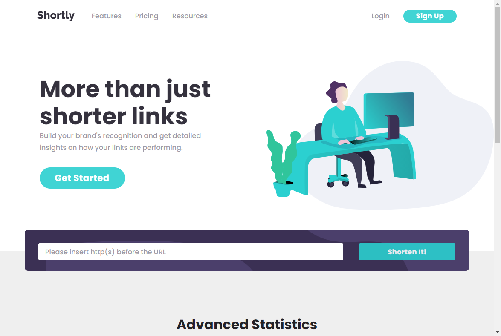
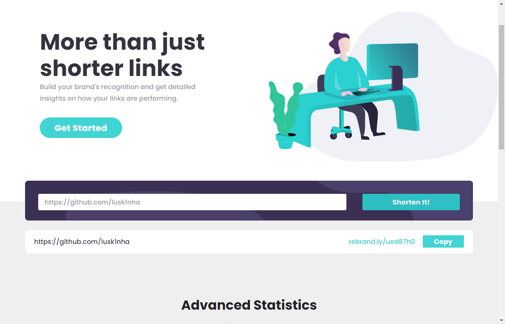
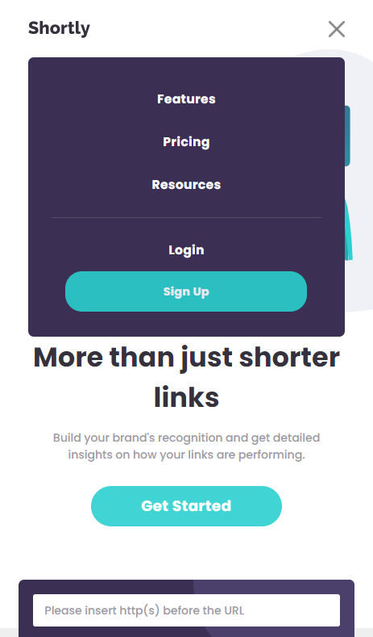
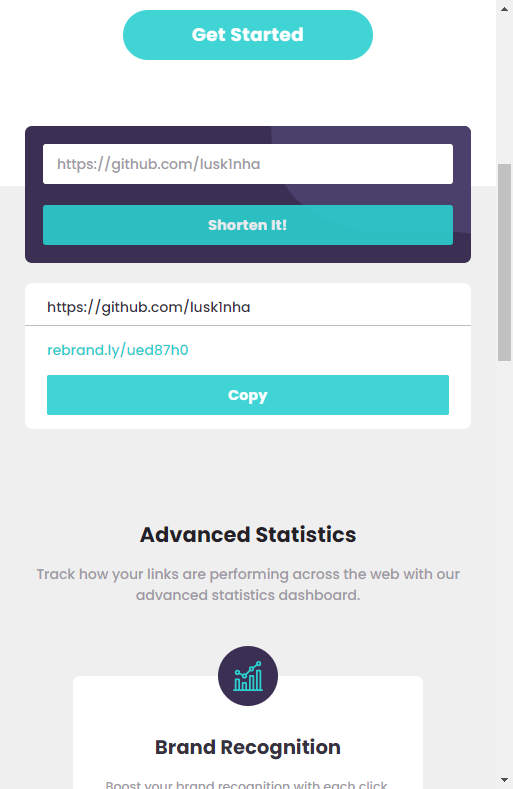

# URL-Shortening-API

A URL shortening app.

# Technologies
In this project I used HTML, SCSS(SASS), JS.

The Api that I used to Short the URL was the [Rebrandly API](https://www.rebrandly.com/)

[This is a challenge of FrontEnd Mentor](https://www.frontendmentor.io/challenges/url-shortening-api-landing-page-2ce3ob-G).

## Result

> ### See the result live [here](https://url-shortening-api-lusk1nha.vercel.app/)

Desktop Version -

Desktop Version Shorted Link - 

Mobile Version -

Mobile Version Shorted Link - 

